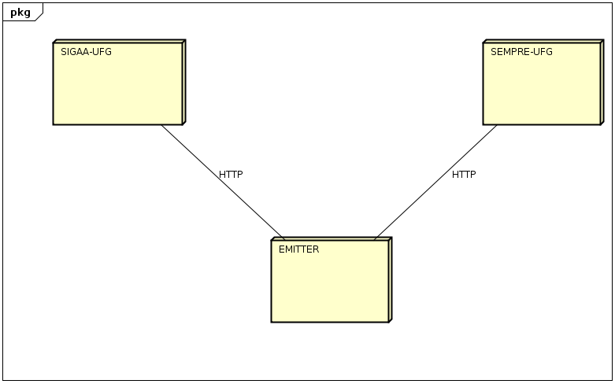
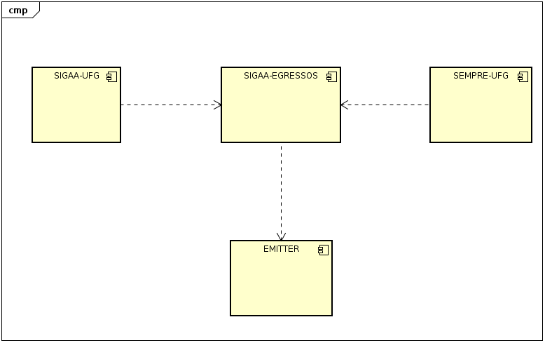

# SIGAA-EGRESSOS

[](https://travis-ci.org/matheuspiment/sigaa-egressos)
[](https://codecov.io/gh/matheuspiment/sigaa-egressos)
[](https://www.npmjs.com/package/sigaa-egressos)
[](https://www.npmjs.com/package/sigaa-egressos)
[](https://github.com/matheuspiment/sigaa-egressos)
[](#contributors)
[](https://opensource.org/licenses/MIT)

> Esta é uma blibioteca para fins acadêmicos e não indicada para uso em produção.

Este projeto tem como objetivo propor uma solução de integração entre o SIGAA-UFG com aplicação SempreUFG, esta destinada ao egressos da universidade, onde por troca de mensagem  a mesma receberia as informações do SIGAA acerca dos alunos em egresso. :mailbox_with_mail:

* [Especificação da Proposta](#especificação-da-proposta)
* [Instalação](#instalação)
* [Exemplo](#exemplo)
* [API](#api)
* [Estrutura da Mensagem](#estrutura-da-mensagem)
* [Equipe](#equipe)

## Especificação da Proposta

### Contexto

Como descrito na introdução acima, a divulgação de notícias e eventos, por exemplo, para os egressos da universidade é de interesse da comunidade acadêmica e fomenta/permetua o contato do ex-aluno com a mesma.

### Diagramas


> Figura 1 - Diagrama de implantação.

O sigaa-engressos vem como uma solução de integração entre os sistemas SIGAA-UFG e SEMPRE-UFG a integração se dará por meio de troca de mensagens para isso é ultilizado o serviço [Emitter](https://emitter.io/).

Conforme apresentado na figura 1 a comunicação entre o SIGAA-UFG e EMITTER, SEMPRE-UFG e EMITTER é realizada através do protocolo HTTP. A figura 2 (abaixo) apresenta a dependência entre os sistemas.


> Figura 2 - Diagrama de dependência.

### Ferramentas/Tecnologias

A "simplicidade" foi o fator determinante nas escolhas técnicas, bem como a familiaridade dos integrantes envolvidos. O objetivo principal foi a adoção de ferramentas/tecnologias com um grande ecossistema/comunidade e que auxiliassem na ornanização dos artefatos e do workflow de desenvolvimento do projeto.

* Comunicação - Informal (por meio de reuniões e conversas)
* Linguagem/Plataforma - [NodeJS](https://nodejs.org/en/)
* Estilo de Código - [ESLint](https://eslint.org/) e [EditorConfig](https://editorconfig.org/)
* Versionamento - [GitHub](https://github.com/) e [Commitizen](https://github.com/commitizen)
* Broker/Canal - [Emitter](https://emitter.io/)
* CI - [Travis CI](https://travis-ci.org/)
* Entrega/Pacote - [NPM](https://www.npmjs.com/) e [semantic-release](https://github.com/semantic-release/semantic-release)

## Instalação

sigaa-egressos para NodeJS:

```shell
npm install sigaa-egressos --save
```

## Exemplo

```javascript
import sigaaEgressos from 'sigaa-egressos';

const messages = [];

const onMessage = (message) => {
  messages.push(message);
  console.log(messages);
};

sigaaEgressos.connect();
sigaaEgressos.subscribe();
sigaaEgressos.onMessage(onMessage);

sigaaEgressos.publish({
  id: 1,
  title: 'Espaço das Profições',
  type: 'evento',
  description: 'A Universidade Federal de Goiás (UFG) realiza nos dias 25 e 26 de junho, o Espaço das Profissões 2018, na Regional Goiânia, uma exposição que aproxima os universitários e profissionais da Instituição de estudantes do ensino médio, interessados em ingressar na UFG.',
});

sigaaEgressos.publish({
  id: 2,
  title: 'UFG está entre as 20 melhores instituições Sul-Americanas em Ciências da Terra e Ambientais',
  type: 'noticia',
  description: 'A Universidade Federal de Goiás (UFG) está entre as 20 melhores instituições Sul-Americanas no que diz respeito às produções na área de Ciências da Terra e Ambientais. O ranking é do Nature Index, um banco de dados sobre publicações, autorias e produtividade dos pesquisadores.',
});
```

## API

* [connect()](#connect)
* [disconnect()](#disconnect)
* [subscribe()](#subscribelast)
* [unsubscribe()](#unsubscribe)
* [publish()](#publishmessage-ttl)
* [onMessage()](#onmessagecallback)

### connect()

Conecta no broker emitter.

### disconnect()

Desconecta do broker.

### subscribe(last)

Inscreve-se no canal.

* `last` - número | opicional - Defini quantas mensagens armazenadas você deseja recuperar.

### unsubscribe()

Desescreve do canal.

### publish(message, ttl)

Publica a mensagem no canal.

* `message` - objeto | requerido - Um objeto javascript com [essa estrutura](#estrutura-da-mensagem).
* `ttl` - número | opicional - É o tempo de vida da mensagem, em segundos.

### onMessage(callback)

Definir a função callback para os pacotes de mensagens recebidos.

* `callback(message)` - function | requerido - Função callback para os pacotes de mensagens recebidos. O argumento `message` segue [essa estrutura](#estrutura-da-mensagem).

## Estrutura da Mensagem

As mensagens publicadas e recebidas seguem o modelo/esquema abaixo, onde essas chaves são as requeridas, podendo haver outras.

> Outras chaves e seus respectivos valores não são verificados pela biblioteca.

```javascript
{
  id: 2,
  title: 'UFG está entre as 20 melhores instituições Sul-Americanas em Ciências da Terra e Ambientais',
  type: 'noticia',
  description: 'A Universidade Federal de Goiás (UFG) está entre as 20 melhores instituições Sul-Americanas no que diz respeito às produções na área de Ciências da Terra e Ambientais. O ranking é do Nature Index, um banco de dados sobre publicações, autorias e produtividade dos pesquisadores.',
}
```

## Equipe

Mais detalhes sobre [emoji key](https://github.com/kentcdodds/all-contributors#emoji-key)

<!-- ALL-CONTRIBUTORS-LIST:START - Do not remove or modify this section -->
<!-- prettier-ignore -->
| [<br /><sub><b>Matheus Pimenta</b></sub>](https://github.com/matheuspiment)<br />[💻](https://github.com/matheuspiment/sigaa-egressos/commits?author=matheuspiment "Code") [📖](https://github.com/matheuspiment/sigaa-egressos/commits?author=matheuspiment "Documentation") [💡](#example-matheuspiment "Examples") [🚇](#infra-matheuspiment "Infrastructure (Hosting, Build-Tools, etc)") [📦](#platform-matheuspiment "Packaging/porting to new platform") [🤔](#ideas-matheuspiment "Ideas, Planning, & Feedback") | [<br /><sub><b>Beatriz Nogueira</b></sub>](https://github.com/BeatrizN)<br />[📖](https://github.com/matheuspiment/sigaa-egressos/commits?author=BeatrizN "Documentation") [🤔](#ideas-BeatrizN "Ideas, Planning, & Feedback") | [<br /><sub><b>Antonio Silva</b></sub>](https://github.com/antoni-s)<br />[📖](https://github.com/matheuspiment/sigaa-egressos/commits?author=antoni-s "Documentation") [🤔](#ideas-antoni-s "Ideas, Planning, & Feedback") | [<br /><sub><b>Keslley L.</b></sub>](https://github.com/keslleylima)<br />[📖](https://github.com/matheuspiment/sigaa-egressos/commits?author=keslleylima "Documentation") [🤔](#ideas-keslleylima "Ideas, Planning, & Feedback") | [<br /><sub><b>Fábio Nogueira de Lucena</b></sub>](http://www.inf.ufg.br/~fabio)<br />[🤔](#ideas-kyriosdata "Ideas, Planning, & Feedback") |
| :---: | :---: | :---: | :---: | :---: |
<!-- ALL-CONTRIBUTORS-LIST:END -->
